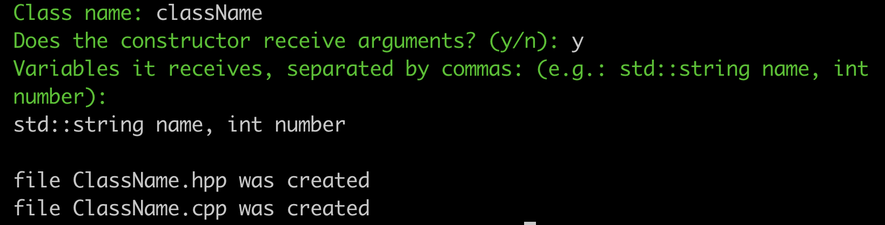
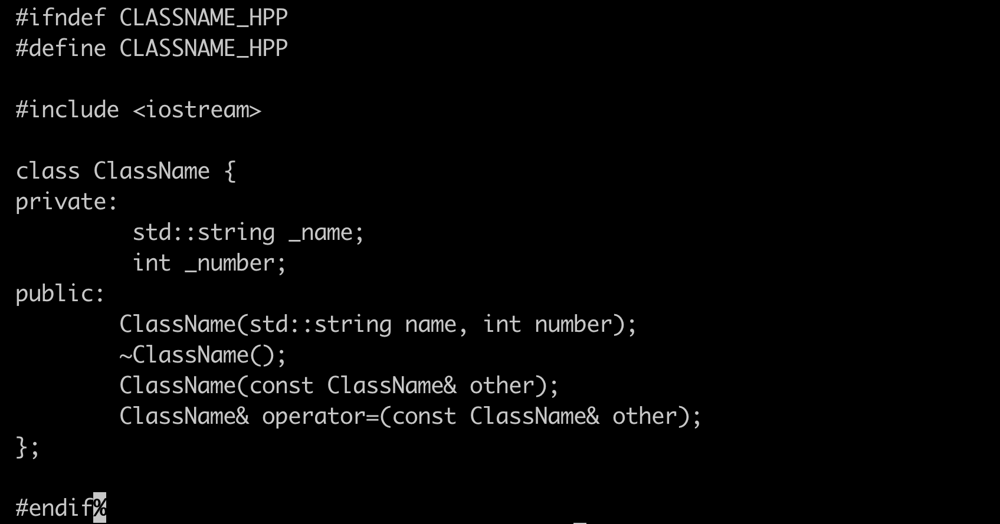
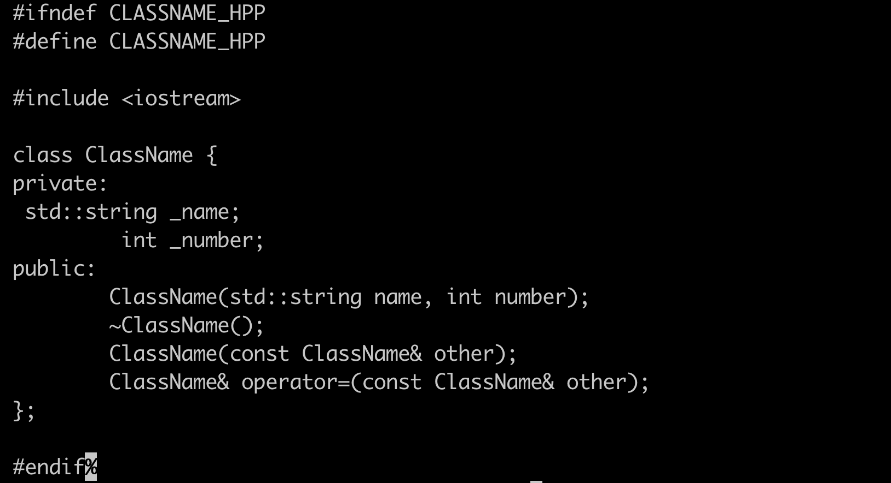

# Orthodox Canonical Form Generator

This Python program helps you generate C++ class files with a header file (.hpp) and an implementation file (.cpp). It prompts you for the class name and whether the constructor should accept arguments. If arguments are required, you can specify them, and the program creates the necessary class files.

## Usage
1. Run the script: ``python cppscript.py``
3. Enter the desired class name.
4. Specify whether the constructor should accept arguments (y/n).
5. If arguments are needed, provide them in the specified format (e.g., `std::string name, int number`).
6. The program will generate the corresponding header (.hpp) and implementation (.cpp) files in the current directory.

## Example

### Usage:

### CPP File:

### HPP File:

